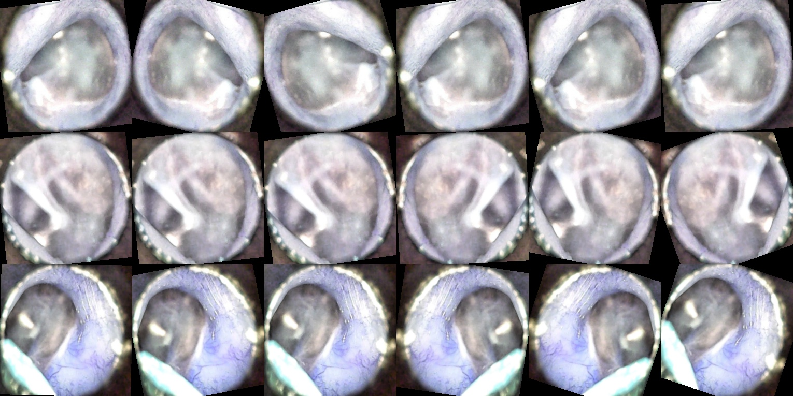

# Otoscope Automation and Enhancement
Classification and enhancement of tympanic membrane images. 

## Dataset Features
 Normal: 1778
 Abnormal:1878
 
 Total: 3656

## Data Enhancement

## Data Augmentation
 Creates a figure that shows how the data is being augmented and transformed.  
   
 Includes Resize, Color Jitter, Random Horizontal Flip and Rotation.  
    
 Update the datasets.ImageFolder to Include a folder titled "Images To Augment" and a subfolder titled "Images" containing all the images you would like to display.  

## Classifier

## Test Data

